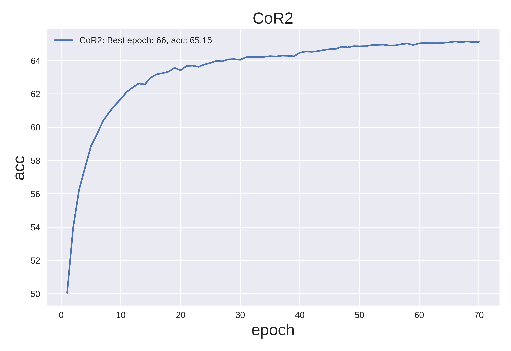

This is the official code for the papers:

"Chain of Reasoning for Visual Question Answer" in NIPS 2018.

"Object-Difference Attention: A Simple Relational Attention for Visual Question Answering" in ACM MM 2018.

# Requirements
python 3.6
pytorch >= 0.4.0
The Others are listed in the requirements.txt

# Preprocessing
Image: Faster-rcnn features
Question: SkipThoughs

# Model
Models with their conf are put into one python file under directory: config/

# Training
The training of CoR2 or ODA
>  python train.py --cf config.CoR2

>  python train.py --cf config.ODA

# Results

